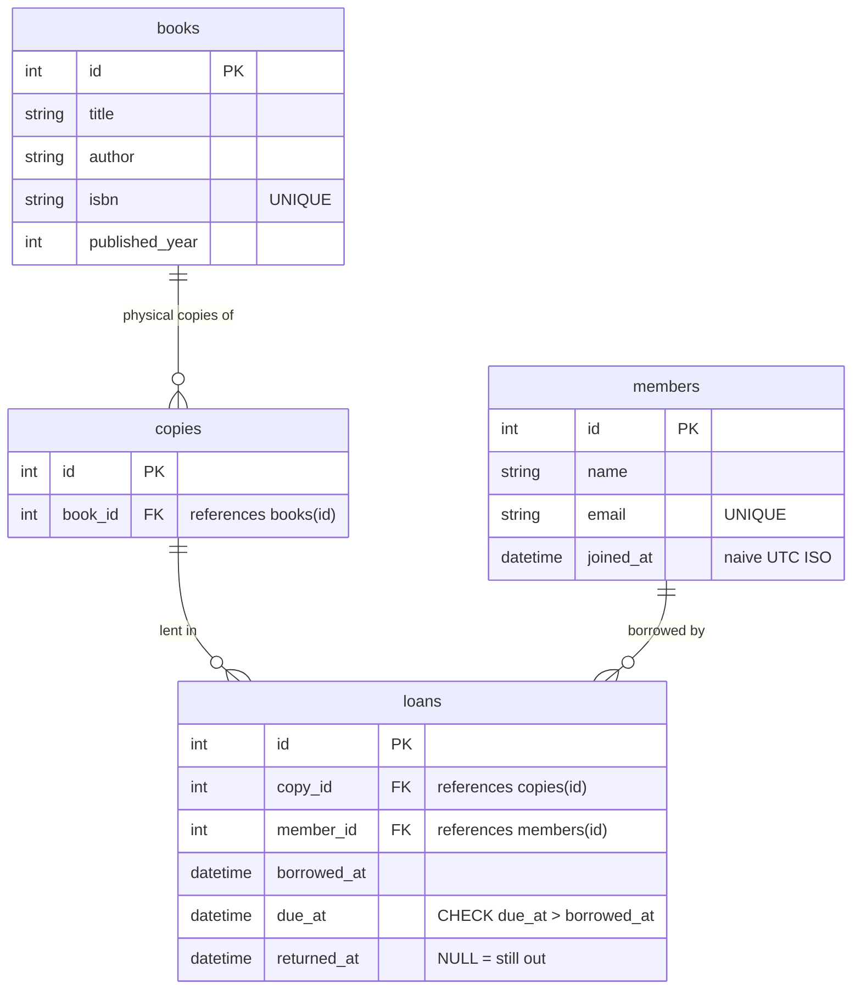
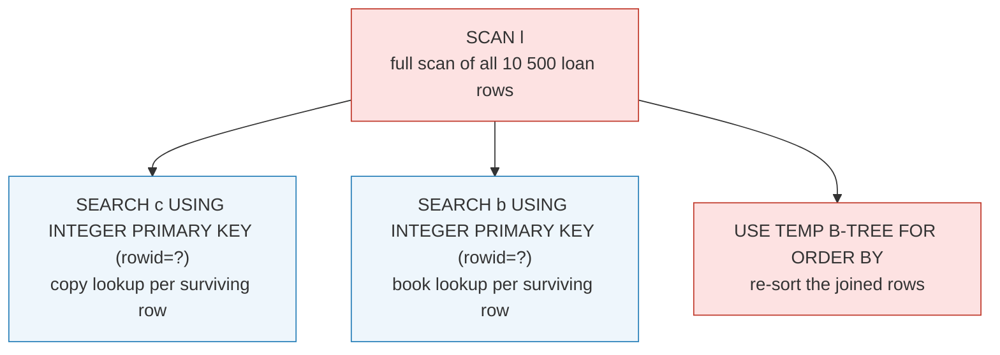
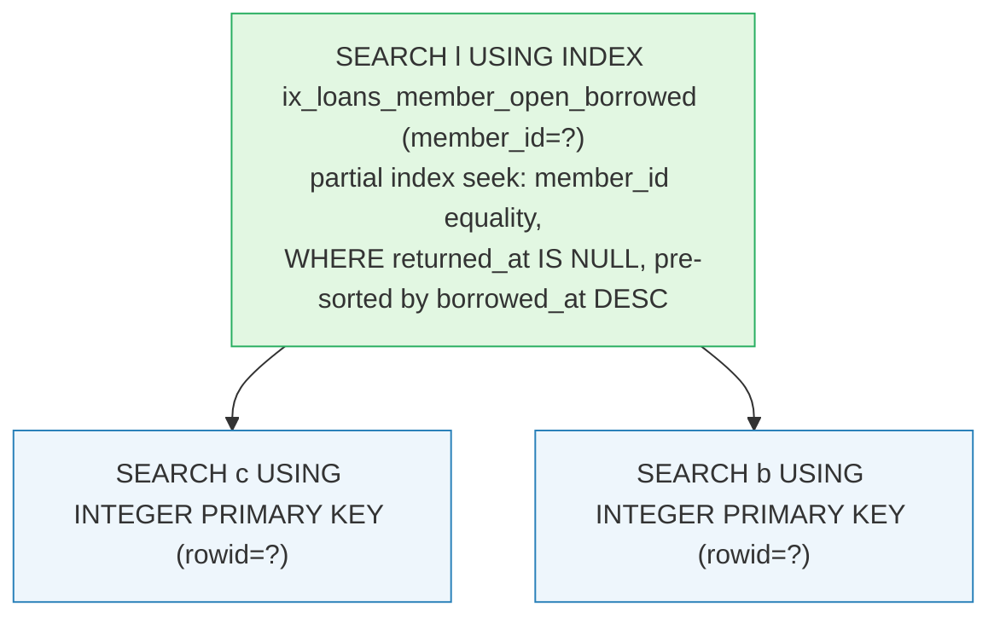
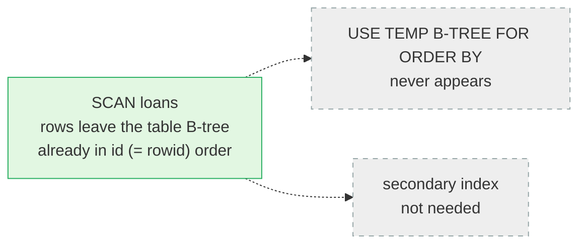

# library-system-fastapi

A small library service built on FastAPI and raw `sqlite3` (no ORM): books,
physical copies of a book, members, and loans.

## Setup

Requires [uv](https://docs.astral.sh/uv/).

```bash
uv sync                       # install dependencies into .venv
uv run python -m app.seed     # create + seed data/library.db (10 500 loans)
uv run uvicorn app.main:app --reload
```

Then open <http://127.0.0.1:8000/docs>.

```bash
uv run pytest                 # test suite
uv run python scripts/measure_query.py   # query-plan benchmark (see below)
```

## Schema



Two partial indexes sit on top (mermaid can't draw them, so here):

- `ux_loans_open_copy` — `UNIQUE (copy_id) WHERE returned_at IS NULL`: the
  double-lend invariant, enforced in the DB (see below).
- `ix_loans_member_open_borrowed` — `(member_id, borrowed_at DESC) WHERE
  returned_at IS NULL`: backs `GET /members/{id}/loans/current`.

Note there is deliberately no `status` column on `copies`: an open loan row
_is_ the state.

## Endpoints

| method | path                          | notes                                                                 |
| ------ | ----------------------------- | --------------------------------------------------------------------- |
| `POST` | `/books`                      | creates a book + `copy_count` physical copies (409 on duplicate isbn) |
| `GET`  | `/books`                      | lists books with `copies_total` / `copies_available`                  |
| `POST` | `/members`                    | 409 on duplicate email                                                |
| `GET`  | `/members/{id}`               | 404 if unknown                                                        |
| `POST` | `/loans`                      | lend a copy — see idempotency below                                   |
| `POST` | `/loans/{id}/return`          | idempotent: replaying returns 200 with the same payload               |
| `GET`  | `/loans`                      | every loan (10 500), id order straight off the rowid B-tree           |
| `GET`  | `/members/{id}/loans/current` | **the query that matters**                                            |

```bash
curl http://127.0.0.1:8000/members/10/loans/current
```

```json
[
  {
    "loan_id": 10142,
    "title": "Paper Archive",
    "borrowed_at": "2026-10-03T21:57:24",
    "due_at": "2026-10-24T21:57:24"
  },
  {
    "loan_id": 10210,
    "title": "Golden Harbor",
    "borrowed_at": "2026-08-19T16:37:14",
    "due_at": "2026-09-09T16:37:14"
  }
]
```

Books currently out for that member, most recently borrowed first, with
title and due date. Loans that have been returned are excluded.

### Checking the runtime of `GET /loans`

The full dump is 10 500 rows (~1.5 MB) in one response. Time it with curl (PowerShell; on other shells `curl` works as-is):

```powershell
curl.exe -s -o loans.json -w "http=%{http_code} time_total=%{time_total}s ttfb=%{time_starttransfer}s size=%{size_download}B`n" http://127.0.0.1:8000/loans

$rows = (Get-Content loans.json -Raw | ConvertFrom-Json).Count
Write-Output "rows=$rows"
```

- `ttfb` (`time_starttransfer`) — first byte: server-side query + JSON serialization
- `time_total` — the whole request, transfer included

Expected on the seeded database: `ttfb ≈ 0.1–0.2 s`, `rows=10500`.

### Double lending is idempotent

`POST /loans` with a copy that is **already out to the same member** writes
nothing and answers `200` with the existing loan (replay-safe). The same
copy out **to a different member** is a `409`. A successful new lend is
`201`.

## Why the "cannot lend twice" rule lives in the database

```sql
CREATE UNIQUE INDEX ux_loans_open_copy ON loans(copy_id) WHERE returned_at IS NULL;
```

This partial unique index says: _among open loans (`returned_at IS NULL`),
`copy_id` may appear only once_. It was chosen over an application-level
check because:

- **A Python check is a race.** Two concurrent lends can both run
  `SELECT ... WHERE copy_id = ? AND returned_at IS NULL`, both see nothing,
  and both insert. The check protects nothing unless the database also
  enforces it — and if the database enforces it, the check was never the
  enforcement.
- **Any other writer bypasses the app.** A script, a REPL, a second
  process, or a future endpoint can write to the same file without going
  through `lend_copy()`. SQLite applies the unique index atomically inside
  the INSERT's write transaction, so no writer — whatever it is — can
  commit a second open loan for the same copy.
- **Single source of truth.** There is deliberately no `status` column on
  `copies` to drift out of sync; "has an open loan" _is_ the state, and the
  index is its guard.

The API translates the constraint: an `IntegrityError` from the index is
re-checked and mapped to a idempotent `200` (same member) or `409` (somebody
else). `tests/test_lending.py::test_database_rejects_second_open_loan_without_app`
proves the guarantee by inserting with raw SQL, bypassing the app entirely.

The seed script builds its data first and creates the index last, so a
generator bug producing a double open loan would make
`CREATE UNIQUE INDEX` fail loudly.

## Query plans: with and without an index

Reproduce with:

```bash
uv run python scripts/measure_query.py
```

The script seeds 10 500 loans (10 000 returned + 500 open), picks the member
with the most open loans (7), runs `EXPLAIN QUERY PLAN` and times 200 runs —
first on tables only, then after creating the production indexes.

**Query**

```sql
SELECT l.id AS loan_id, b.title, l.borrowed_at, l.due_at
FROM loans l
JOIN copies c ON c.id = l.copy_id
JOIN books b ON b.id = c.book_id
WHERE l.member_id = ? AND l.returned_at IS NULL
ORDER BY l.borrowed_at DESC;
```

**Before — no secondary indexes**



SQLite walks all 10 500 loan rows, keeps the member's open loans, then
sorts them in a temporary B-tree.

**After — production indexes**



The partial index

```sql
CREATE INDEX ix_loans_member_open_borrowed
    ON loans(member_id, borrowed_at DESC) WHERE returned_at IS NULL;
```

matches the filter (`member_id = ?`), the open-loan condition (its `WHERE`
clause) and the sort order (`borrowed_at DESC`) in one structure: SQLite
seeks straight to the member's open loans, already sorted, and the
`USE TEMP B-TREE FOR ORDER BY` disappears.

**Timing (200 runs, warm cache, 10 500 loans)**

| phase  | mean     | median   | min      | rows |
| ------ | -------- | -------- | -------- | ---- |
| before | 0.796 ms | 0.758 ms | 0.736 ms | 7    |
| after  | 0.027 ms | 0.025 ms | 0.024 ms | 7    |

≈ **30x** faster, and the cost now scales with the member's open loans
rather than with the whole table.

The invariant index `ux_loans_open_copy` is on `copy_id` and cannot serve
this query — it exists purely to guard the rule above.

**`GET /loans` — full dump of all 10 500 rows**



`ORDER BY id` rides SQLite's own table B-tree (the INTEGER PRIMARY KEY
_is_ the rowid), so the dump is a single pass in index order — nothing to
sort, no index to pick. The plan only pays for the rows it returns.

## Project layout

```
app/db.py                  schema DDL, connection factory, shared queries
app/main.py                FastAPI app and endpoints
app/seed.py                deterministic seed (10 000+ loans), CLI: python -m app.seed
app/schemas.py             pydantic request/response models
app/dates.py               naive-UTC helpers, 21-day loan period
scripts/measure_query.py   before/after query-plan benchmark
tests/                     pytest suite (invariant, idempotency, ordering)
```
